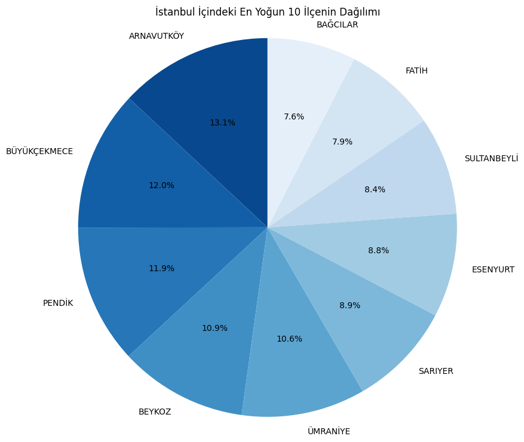

# ========================================
# Müşteri Veri Seti Coğrafi ve Demografik Analiz Projesi
# ========================================
Bu projenin temel amacı, 1 milyon satırlık sahte Türk müşteri veri setini inceleyerek müşteri tabanının coğrafi yoğunluk ve temel demografik dağılımlarını tespit etmektir. Analiz, veri görselleştirme kütüphaneleri (Pandas, Matplotlib, Seaborn) kullanılarak, müşteri popülasyonunun yapısını ve dağılımını anlamayı hedeflemektedir.

# Somut Bulgular ve Analizler
## Coğrafi Bulgular
Müşteri kayıtlarının büyük bir çoğunluğu, Türkiye'nin metropol illerinde kümelenmiştir.

- **Şehir Yoğunluğu** : Kayıt sayısı en yüksek olan ilk şehirler (İstanbul, Ankara vb.) yatay sütun grafiği ile açıkça görülebilmektedir.

- **İlçe Dağılımı** : İstanbul ve Ankara için yapılan detaylı pasta grafiği analizleri, müşteri yoğunluğunun şehir içindeki belli başlı 10 ilçede toplandığını ve bu ilçelerin paylarının yüzdelik olarak dağılımını göstermektedir.

Müşteri tabanı, genel nüfus yoğunluğuna paralel olarak büyükşehirlerde ve bu şehirlerin merkezi/yoğun ilçelerinde kümelenmektedir. Bu, bölgesel pazarlama veya operasyon planlamaları için kritik bir bilgidir.

## Demografik Bulgular
- **Cinsiyet Oranları** : Erkek ve Kadın kayıtlarının birbirine yakın yüzdelik değerlere sahip olduğu net bir şekilde gözlemlenmiştir.

