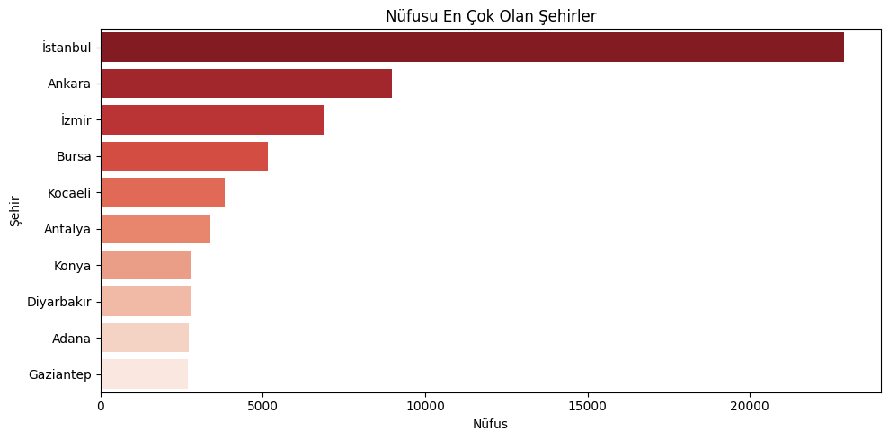
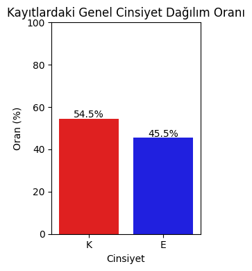

# =====================================
# Müşteri Veri Seti Coğrafi ve Demografik Analiz Projesi
# =====================================
- Bu projenin temel amacı, 1 milyon satırlık sahte Türk müşteri veri setini inceleyerek müşteri tabanının coğrafi yoğunluk ve temel demografik dağılımlarını tespit etmektir. Analiz, veri görselleştirme kütüphaneleri (Pandas, Matplotlib, Seaborn) kullanılarak, müşteri popülasyonunun yapısını ve dağılımını anlamayı hedeflemektedir.
- Grafiklerde kullanılan **'Nüfus'** terimi, analiz edilen 1 milyon satırlık müşteri veri setindeki **kayıt sayısını** ifade etmektedir. Yani, bu **'Müşteri Nüfusunun'** coğrafi veya demografik dağılımını gösterir. Örneğin 'İstanbul Nüfusu', veri setimizdeki İstanbul'a ait toplam **kayıt sayısını** temsil etmektedir.
# Somut Bulgular ve Analizler
## Coğrafi Bulgular
Müşteri kayıtlarının büyük bir çoğunluğu, Türkiye'nin metropol illerinde kümelenmiştir.

- **Şehir Yoğunluğu** : Kayıt sayısı en yüksek olan ilk şehirler yatay sütun grafiği ile açıkça görülebilmektedir.

- **İlçe Dağılımı** : İstanbul ve Ankara için yapılan detaylı pasta grafiği analizleri, müşteri yoğunluğunun şehir içindeki belli başlı 10 ilçede toplandığını ve bu ilçelerin  yüzdelik olarak dağılımını göstermektedir.

Müşteri tabanı, genel nüfus yoğunluğuna paralel olarak büyükşehirlerde ve bu şehirlerin merkezi/yoğun ilçelerinde kümelenmektedir. Bu, bölgesel pazarlama için kritik bir bilgidir.

## Demografik Bulgular
- **Cinsiyet Oranları** : Erkek ve Kadın kayıtlarının birbirine yakın yüzdelik değerlere sahip olduğu net bir şekilde gözlemlenmiştir.

# Stratejik Çıkarımlar ve Öneriler

| Alan | Stratejik Odak | Aksiyon Önerisi |
| :--- | :--- | :--- |
| **Pazarlama** | **Geo-Targeting Optimizasyonu** | Bütçenin büyük çoğunluğu, kayıt yoğunluğunun en yüksek olduğu **ilk 5 şehre** ve özellikle İstanbul ile Ankara'daki **ilk 10 ilçeye** odaklanmalıdır. |
| **Operasyon** | **Lojistik Verimlilik** | Yoğun ilçelere yakın küçük dağıtım merkezleri veya teslimat noktaları kurularak lojistik maliyetleri düşürülmeli ve teslimat süreleri iyileştirilmelidir. |
| **Ürün/Hizmet** | **Kapsayıcı İletişim** | Cinsiyet dağılımı dengeli olduğu için, iletişim dili ve ürün özellikleri her iki cinsiyete de eşit hitap etmeli, nötr ve kapsayıcı mesajlar kullanılmalıdır. |
